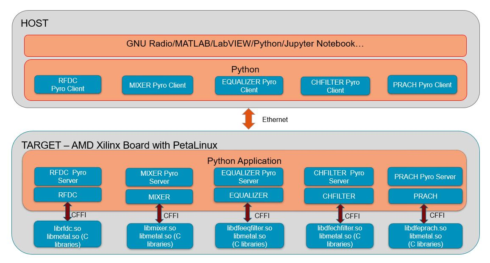

<h1> RAFT </h1>
Rapid Abstraction FPGA Toolbox (RAFT) is a Python toolbox which provides direct access to FPGA hardware peripherals. RAFT runs in petalinux and provides access to various C driver library APIs through python. It support access to the APIs directly from the board as well as from remote host. Command line access to Linux is also possible. This gives flexibility for user to develop applications directly in the board or at remote host. The python APIs can be accessed at remote host from tools like MATLAB, GNURadio, LabView etc which supports python.
<h1> Directory Structure </h1>

The software is divided into following directories:  

<li>xserver
  <ul>
    
contains cffi code which converts c driver APIs to python and
    pyro server code which runs in the board 

  </ul>
</li>

<li>xclient
  <ul>
    
contains pyro client that can communicate with the corresponding pyro server

  </ul>
</li>

<li>examples
  <ul>
    
contains usage examples in different tools

  </ul>
</li>

<li>c_lib
  <ul>
    
contains libraries which need to be added with petalinux build as recipes

  </ul>
</li>
<li>docs
  <ul>
    
contains the necessary documenatation 

  </ul>
</li>

<h1> Software Stack </h1>

 The C driver APIs which are accessible as a Linux shared object are pythonized by RAFT xcffi. This can be accessed directly at the board or at a host over Pyro. At host the APIs can be accessed directly over Pyro or through a python client. The client provides debug logs and help in easier integration with tools like MATLAB. 

<h1> Building petalinux with RAFT </h1>
Refer the steps in build_petalinux_with_raft.txt which is at docs directory

<h1> Steps to use RAFT at board and host </h1>
Refer the steps in raft_usage.txt which is at docs directory
